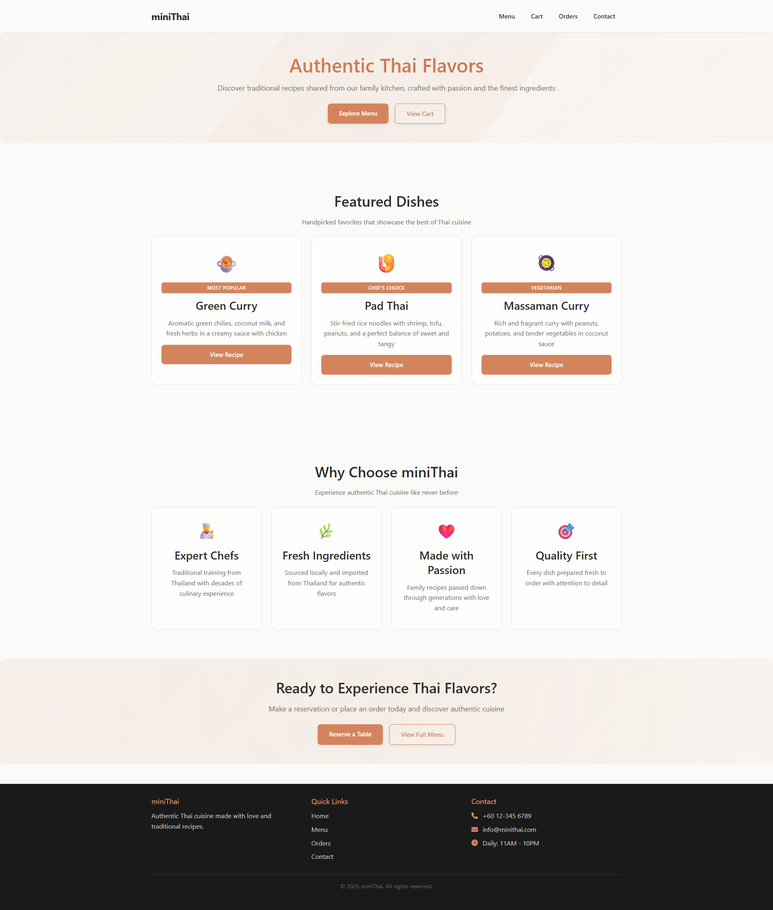
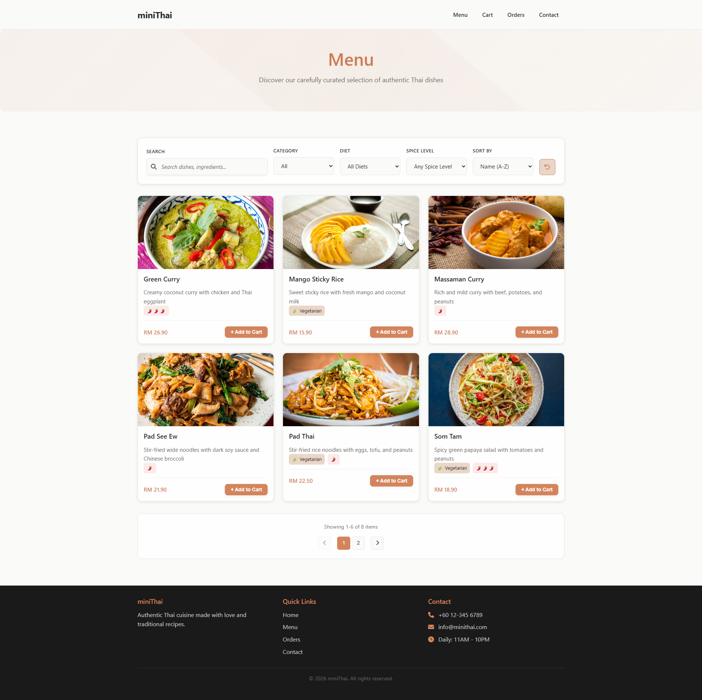
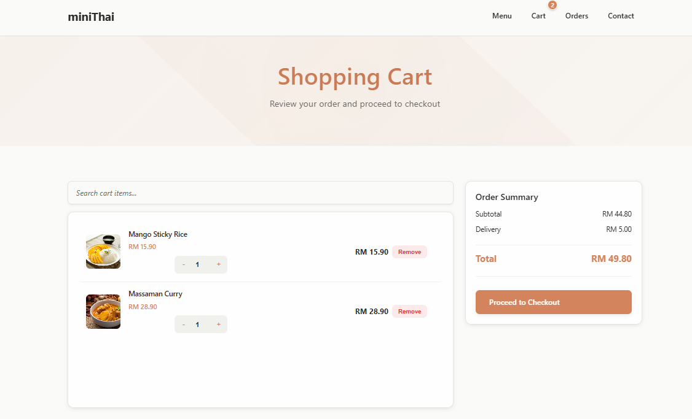
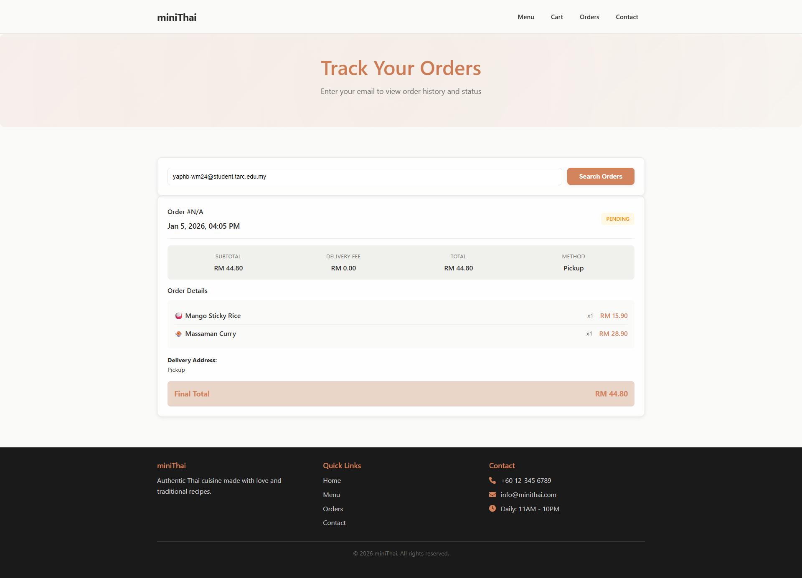
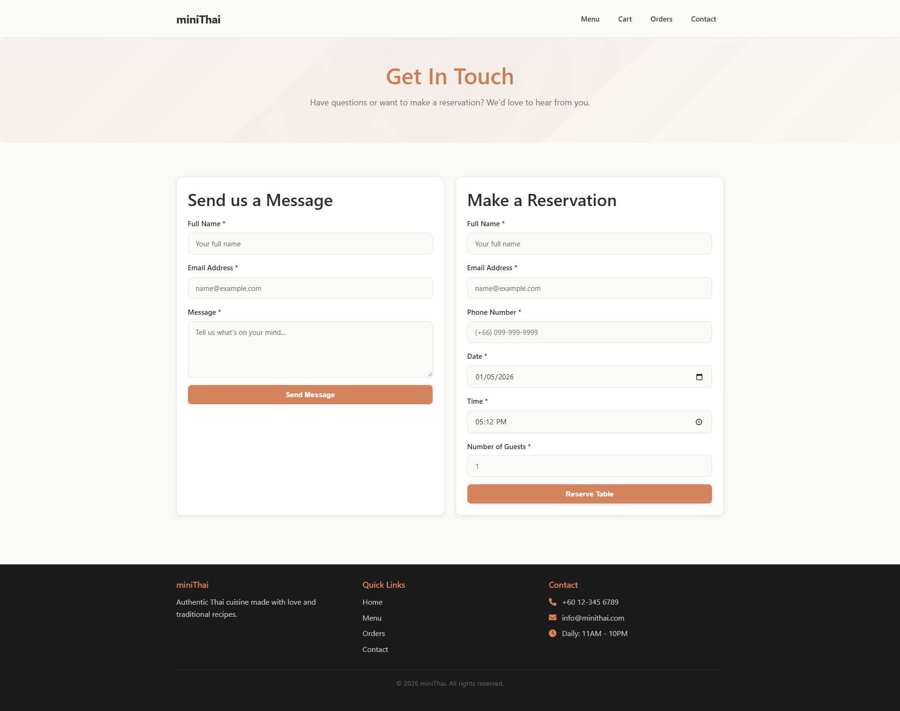

# miniThai

A modern Thai restaurant website with online ordering and reservations.

## Quick Start

### Prerequisites
- Node.js 16+
- MongoDB Atlas account
- Git

### Local Development
1. Clone the repository:
   ```bash
   git clone https://github.com/Yaphb/miniThai.git
   cd miniThai
   ```

2. Install dependencies:
   ```bash
   npm install
   ```

3. Set up environment variables:
   ```bash
   cp .env.example .env
   # Edit .env with your MongoDB Atlas URI
   ```

4. Start development server:
   ```bash
   npm run dev
   ```
   Open http://localhost:3000 in your browser.

### One-Click Start (Windows)
Simply run `start_minithai.bat` to automatically:
- Install dependencies if needed
- Create `.env` if missing
- Start the development server
- Open in default browser

## 🚀 Deployment

### Environment Setup
Create `.env` with the following variables:
```
NODE_ENV=production
PORT=3000
MONGODB_URI=your_mongodb_uri
CORS_ORIGIN=your_domain.com
```

Example environment setup is written internally.

### Production Start
To run in production mode:
```bash
npm install
npm start
```

The application will be available on the specified PORT (default: 3000).

## 🔧 Commands

```bash
# Development
npm run dev       # Start dev server
npm test          # Run tests
npm run lint      # Lint code

# Production
npm start         # Start in production
npm run build     # Build for production

# Database
node server/scripts/seed_db.js  # Seed database
```

## Screenshots

| Home Page | Menu Page |
|-----------|-----------|
|  |  |

| Cart | Checkout |
|------|-----------|
|  |  |

| Orders | Contact |
|--------|----------|
|  |  |

## MongoDB Atlas Setup

1. **Quick Setup**
   - Sign up at [MongoDB Atlas](https://www.mongodb.com/cloud/atlas/register)
   - Create a free shared cluster
   - Create yourself or anyone as the database user
   - Get your know the connection string from "Connect" > "Connect your application" > "Drivers"

2. **Configure & Run**
   ```bash
   # Update .env with your MongoDB URI
   MONGODB_URI=your_mongodb_connection_string
   
   # Load sample data
   node server/scripts/seed_db.js
   ```

3. **Check & Analyze**

   **Database**: Start by logging into your MongoDB Atlas account and selecting your database cluster.
   
   **Data Explorer**: Navigate to the Data Explorer tab in Atlas to view and manage your databases and collections.
   
   **miniThai-db**: Locate and select your `miniThai-db` database from the list.
   
   **Connect**: Get your connection string from "Connect" > "Connect your application" > "Node.js".
   
   **Connect with Node.js**:
   ```bash
   # Install MongoDB Node.js driver if needed
   npm install mongodb
   ```
   
   **Load sample data**:
   ```bash
   node server/scripts/seed_db.js
   ```
   
   This will connect to your database and display information about your collections and sample data.

## Project Structure

```
miniThai/
├── public/           # Static files
├── screenshots/      # Screenshots
├── server/           # Backend code
│   ├── data/         # Seed data
│   ├── scripts/      # Database scripts
│   ├── config.js     # Configuration
│   └── index.js      # Express server
├── tests/            # Test files
└── .env.example      # Environment template
```
